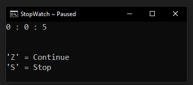

# StopWatch
A simple Batch Script, turned into a Stopwatch program.

> Screenshots

 

 

> :diamond_shape_with_a_dot_inside: New Themes

# Operating platform
Windows Only

# Installation
:arrow_down:[Download](https://github.com/Reymor/StopWatch/releases) the .bat file and double click on it to run.

